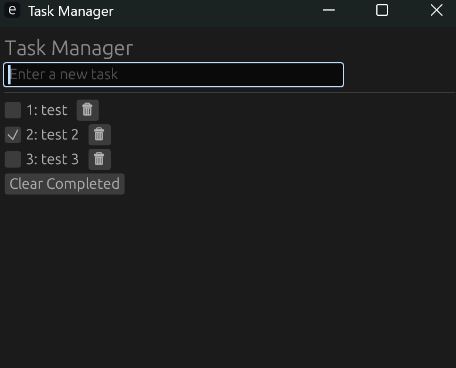

# Tasker
A ridiculously simple task list app in Rust made to learn some syntax. Uses a local .json file for storing your task list persistently.

## Screenshot

## Usage
### Build
Just use `cargo build`, nothing fancy.

### GUI
To run the GUI version:
`tasker.exe --gui`

### CLI
To run the CLI version
`tasker.exe *COMMAND*`

### Commands for CLI:
  add - Add a new task with the given description
  
  list - List all tasks
  
  done - Mark a task as done by ID
  
  undone - Mark a task as not done by ID
  
  remove - Remove a task by ID
  
  clear-completed - Clear all completed tasks
  
  clear-all - Remove all tasks
  
  help - Print this message or the help of the given subcommand(s)
